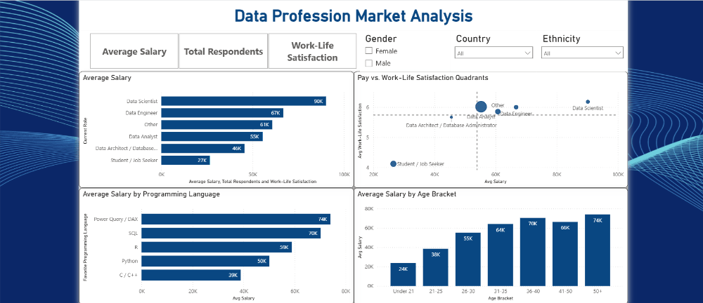

# Data Profession Market Analysis

An end-to-end analysis of a public survey of data professionals — cleaned in **MySQL** and visualized in an interactive **Power BI** dashboard covering salaries, job satisfaction, and demographics across the data industry.

---

## 📌 Overview

This project explores survey responses from **630 data professionals** (Data Analysts, Data Scientists, Data Engineers, Database/Architecture roles, students/job-seekers, and others) collected between **June 10–26, 2022**. The goal is to understand:

- How **salary** varies by role, programming language, and age group
- How **job satisfaction** (pay, work-life balance, coworkers, management, upward mobility, learning) relates to compensation
- Who makes up the data profession — **country, gender, ethnicity, age, and education**
- How people **broke into** the field and what they value most in a role

The raw survey export was cleaned and standardized in MySQL, then loaded into Power BI to build an interactive dashboard.

---

## 🗂️ Repository Contents

```
├── data/
│   ├── raw_survey_data.csv          # Original, unprocessed survey export (28 columns, 630 responses)
│   └── cleaned_survey_data.csv      # Cleaned dataset (24 columns, 630 responses)
├── sql/
│   └── data_cleaning.sql            # MySQL script used to clean the raw data
├── screenshots/
│   └── dashboard_demo.gif           # Walkthrough of the Power BI dashboard
├── pbix/
│   └── Data_Profession_Market_Analysis.pbix   # Power BI dashboard file built on the cleaned dataset
└── README.md
```

---

## 🧰 Tools Used

- **MySQL** — data cleaning, standardization, and transformation
- **Power BI** — data modeling (DAX measures) and dashboard/report building
- **CSV** — raw and cleaned data storage

---

## 🧹 Data Cleaning (MySQL)

The raw export included personally-identifying/technical metadata (email, browser, OS, city, referrer, time spent, timestamps) and free-text, inconsistently formatted survey answers. Comparing the raw and cleaned files, the following transformations were applied in MySQL:

- **Dropped non-analytical columns**: `Email`, `Browser`, `OS`, `City`, `Country` (webform), `Referrer`, `Time Spent`, `Time Taken`
- **Renamed / standardized fields** for clarity, e.g. `Q1 → Current_Role`, `Q5 → Favorite_Language`, `Q13 → Clean_Ethnicity`
- **Parsed salary ranges into numeric fields**: `Q3 - Current Yearly Salary` (e.g. `"106k-125k"`) was split into `min_salary`, `max_salary`, and a computed `avg_salary`
- **Normalized free-text "Other (Please Specify)" answers** into consistent categories:
  - Roles collapsed into: `Data Analyst`, `Data Engineer`, `Data Scientist`, `Data Architect / Database Administrator`, `Student / Job Seeker`, `Other`
  - Countries cleaned from `"Other (Please Specify): Nigeria"` → `Nigeria`
  - Industries standardized into consistent buckets (e.g. `Tech / IT`, `Finance / Banking`, `Energy / Oil & Gas`)
  - Ethnicity labels standardized (e.g. `"White or Caucasian"` → `White / Caucasian`)
- **Reformatted dates**: `Date Taken` → `Clean_Date` (standard `YYYY-MM-DD` format)
- **Bucketed ages** into an `Age_Brackets` column (`Under 21`, `21-25`, `26-30`, `31-35`, `36-40`, `41-50`, `50+`)
- **Handled missing values** across the six `Satisfaction_*` fields (5–13 missing values per column out of 630 rows)

The result is a tidy, analysis-ready table with **24 columns** and **630 rows**, feeding directly into the Power BI data model as the `Data_Survey` table.

---

## 📊 Dashboard (Power BI)

The `.pbix` file contains a single interactive report page plus a custom hover tooltip page, built on the `Data_Survey` table.

### Main page
| Visual | Details |
|---|---|
| **Dynamic KPI card** | Title/value driven by a metric selector, via a `Dynamic_Title` measure |
| **Metric selector (slicer)** | A field-parameter style slicer (`Select_Metric`) that switches the bar chart below between **Average Salary**, **Total Respondents**, and **Average Work-Life Satisfaction** |
| **Bar chart** | Current role vs. the selected metric — lets you compare roles on whichever measure you pick |
| **"Pay vs. Work-Life Satisfaction Quadrants"** (scatter) | X = average salary, Y = average work-life satisfaction, bubble size = number of respondents, colored by role — highlights which roles combine high pay with high satisfaction |
| **"Average Salary by Programming Language"** (clustered bar) | Compares average salary across favorite languages (Python, R, SQL, C/C++, Power Query/DAX) |
| **"Average Salary by Age Bracket"** (clustered column) | Compares average salary across the age buckets |
| **Slicers** | Country, Gender, Ethnicity — filter the entire page |

### Tooltip page
A custom tooltip page with four KPI cards shown on hover: **average salary**, **total respondents**, **total work-life satisfaction**, and **salary vs. average (%)** — giving quick context without cluttering the main visuals.

---

## 🔎 Key Insights

- **Data Analyst** is the most common role (393 respondents, ~62%), followed by students/job-seekers (90) and Data Engineers (42).
- **Python** is the most popular language (421, ~67%), well ahead of R (101) and SQL (51).
- Average reported salary is **~$53,900** (median ~$53,000), ranging from the `$0–40k` bracket up to `$225k+`.
- The **United States** dominates the respondent pool (261, ~41%), followed by **India** (73), the **UK** (40), **Canada** (32), and **Nigeria** (30).
- **Tech/IT** (155), **Finance/Banking** (97), and **Healthcare** (86) are the top three industries represented.
- The largest age group is **26–30** (215 respondents), followed by **21–25** (180).

*(Explore the dashboard directly for satisfaction breakdowns by role, country, gender, and ethnicity.)*

---

## ✅ Known Limitations (Addressed)

An earlier pass of the cleaning script had a few classification issues that were identified and fixed before finalizing the dataset used in the dashboard:

- **Language misclassification**: a substring-matching bug had grouped several unrelated free-text answers (Excel, VBA, SAS, JavaScript, etc.) under `R`, inflating that category. Matching logic was corrected to only match on the actual stated language.
- **Industry misclassification**: a similar substring bug had routed entries like `Audit Firm` and `Hospitality` into `Tech / IT` due to the substring "it". Matching logic was corrected to check for the term as its own word.
- **Salary bracket calculation**: the `150k-225k` bracket had an incorrect upper bound, understating `avg_salary` for that group. This has been corrected to reflect the true bracket range.

The dataset in this repo (`data/cleaned_survey_data.csv`) and `sql/data_cleaning.sql` both reflect the corrected logic.

Remaining, inherent limitations of the source data itself:
- **Self-reported survey data**: salaries, satisfaction scores, and demographics are self-reported and unverified.
- **Salary is bucketed, not exact**: `avg_salary` is the midpoint of a reported range, not a precise figure.
- **Small sample for some subgroups**: countries, industries, and ethnicities outside the top few categories have limited respondents, so cuts of the data by those slicers can be noisy.
- **Survey window is narrow**: all responses were collected over a ~2-week period (June 10–26, 2022), so this is a snapshot, not a trend over time.

---

## 🚀 How to Use

1. Clone or download this repository.
2. Open `Data_Profession_Market_Analysis.pbix` in **Power BI Desktop** (free download from Microsoft).
3. Use the slicers (Country, Gender, Ethnicity, Metric selector) to filter and explore the data.
4. To reproduce the cleaning step yourself, run `sql/data_cleaning.sql` against `data/raw_survey_data.csv` loaded into MySQL, or inspect `data/cleaned_survey_data.csv` directly.

---

## 📸 Dashboard Demo


